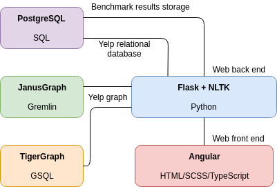

# Providentia
A web-based bench marking tool for testing query speeds of graph databases vs relational in the context of spatio-temporal data mainly using the Yelp challenge dataset.

## Project Structure

* Client is based on Angular7+.
* API is Flask and is used to communicate with the client for analysis using NLTK and other statistic techniques to simulate 'real' analysis.

## Databases
The following databases are being benchmarked:
* JanusGraph with Cassandra and ElasticSearch
* PostgreSQL with PostGIS
* TigerGraph

## Hardware Requirements
Not all databases need to be run at the same time, but once they each have the dataset imported along with the NLTK classifiers the memory requirements stack up. To counter this, many of the configuration files contain percentage modifiers for how much of the data you would like loaded up. 

The following are my minimum hardware requirements in terms of a full production run:

* Intel i5 / AMD Ryzen 5
* 32 GB RAM
* 12 GB storage for training data and the Yelp challenge dataset

## Development

Before you start, first make sure your databases are setup. Navigate to `providentia-db` to have a look at how to start the Docker containers and use the `normalize-yelp` script to clean up the Yelp challenge data a bit. After that is done, import the data using the `import-tool` (which is where you can find my database schemas). Once that's complete you should then be ready to spin up the web application.
