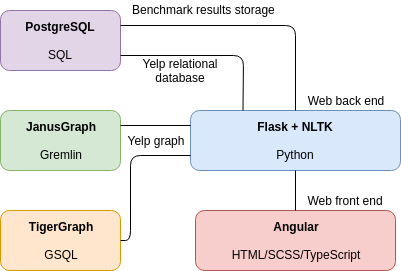

# Providentia
A web-based bench marking tool for testing query speeds of graph databases vs relational in the context of spatio-temporal data mainly using the Yelp challenge dataset.

## Project Structure

* Client is based on Angular7+.
* The REST API is a Flask based backend. It is used to communicate with the client for analysis using NLTK and other statistic techniques to simulate 'real-world' analysis.
* The Flask backend communicates with the databases.

## Databases
The following databases are being benchmarked:
* JanusGraph with Cassandra and ElasticSearch
* PostgreSQL with PostGIS
* TigerGraph

## Hardware Requirements
Not all databases need to be run at the same time, but once they each have the dataset imported along with the NLTK classifiers the memory requirements stack up. To counter this, many of the configuration files contain percentage modifiers for how much of the data you would like loaded up. 

The following are my minimum hardware requirements in terms of a full production run:

* Intel i5 / AMD Ryzen 5
* 32 GB RAM
* 18 GB storage for training data and the Yelp challenge dataset

## Setting Up

The following are the steps on how to prepare and run Providentia:

* First go to `providentia-db` and follow the steps there in order to launch each database, preprocess and import the dataset.
* Go to `providentia-flask` to configure the Flask backend.
* Go to `providentia-ng` to configure the Angular frontend.
* Once all of the databases are ready and the web application is configured, run `docker-compose up` in this directory to begin the web application.

## Project Documentation and Presentation

The document report, poster, and presentation source code can be found under `providenta-docs`.
