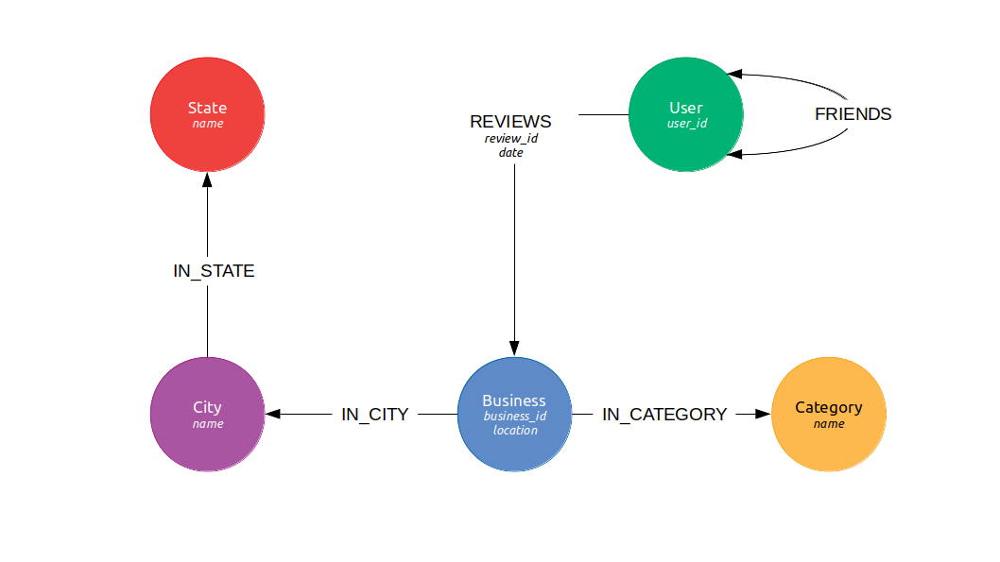

# Import Tool
Import Yelp (round 13's) dataset into various databases.

## Yelp JanusGraph Schema

The above diagram illustrates the schema created by this application. Indices created on vertices holding custom unique IDs from the data filtered by vertex labels. What is indexed in the graph is written in italics on the diagram.

If you would like to create the schema via this tool then make sure to set the `import.load-schema` is set to true under `src/main/resources/janus-graph.properties`.

## Importing Data Into TigerGraph

TigerGraph data is imported using the batch offline import utility. See `../docker-containers/tigergraph/`. This is 
due to insert speeds being much slower than this solution. The schema for TigerGraph is imported via the GraphStudio interface and is found at `../docker-containers/tigergraph/tigergraph.tar.gz`.

## Existing data

The import tool does not check for existing data as this slows down the import process. All checks are handled when a subset of the data is created from `normalize-dataset`.

## Import Tool Configuration Reference
This application's properties can be modified via `src/main/resources/data.properties`. The following are the configurations native to this tool with a description for each:

|Configuration|Description|Default Value|
|----|----|----|
|`yelp.*`|Indicates where the respective subset of the Yelp datafile is.|N/A|
|`database.*`|Indicated whether the data is to be imported to the respective database or not|N/A|
|`import.queue-size`|Configures the maximum number of lines to add to a transaction before committing it to the DBMS. This is used to exploit the bulk-loading option.  This is kept fairly low to prevent ghost vertices/edges being created. Once can play with this setting to find optimal balance where self-dependent data is not affected, e.g. businesses.|100|
|`import.sector-size`|The sector size of the file being read where a sector defines a fraction of the datafile. The way this is used is that if the number records read exceed the size of the current sector in which number of records processed lie then the tool stops creating new jobs to prevent GC memory overflow.|0.10|

## Deprecated Functionality

Cassandra and ElasticSearch was a potential database to be benchmark but was disgarded and replaced with TigerGraph. The code remains in case this is picked up again.
